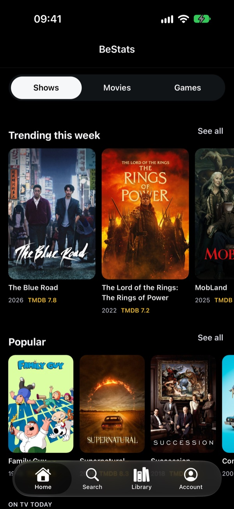
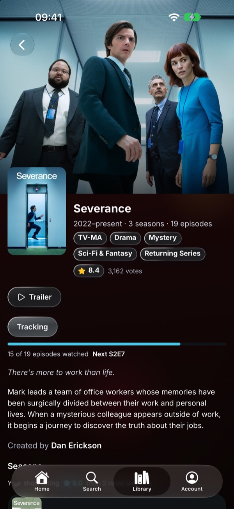
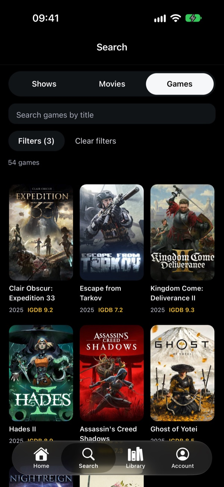
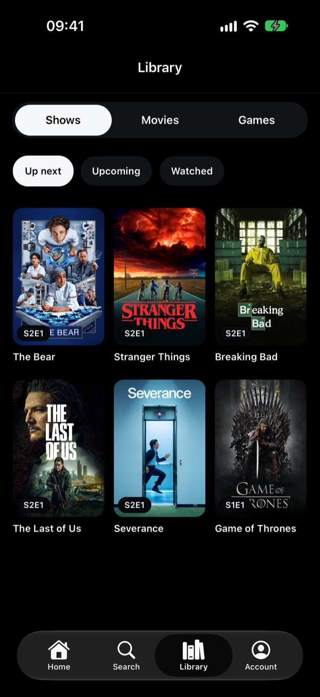

# BeStats

[](https://github.com/kris1027/BeStats/actions/workflows/checks.yml)

A tracker for TV shows, movies and games, inspired by TV Time, as a web app and a mobile app. You browse and search the catalog, keep a private list of what you plan to watch or play, mark movies and episodes watched, and rate what you finish. BeStats tracks what you watch and play; it does not stream anything.

- **Web:** [bestats-app.vercel.app](https://bestats-app.vercel.app), built with Next.js. It also serves the API the mobile app uses.
- **Mobile:** an Expo app for iPhone, reading the catalog and your data through that API.

TMDB supplies movie and TV metadata, IGDB supplies game metadata, and Supabase stores accounts and your private data, so both apps show the same library. The stack and product rules live in [AGENTS.md](AGENTS.md); installed versions live in each `package.json`.

> **The website is temporarily paused** (since 2026-11-21) to stay within the Vercel Hobby plan: its pages answer `403`, while the API, `/privacy` and `/terms` stay up and the mobile app works as usual. Everything still runs locally, and [docs/deploy.md](docs/deploy.md), section 5, explains how to switch it back on.

## What it does

- **Catalog:** shows, movies and games, each with a home page of rows and paged lists (trending, popular, top rated and more), plus title pages with cast, seasons and episodes.
- **Search:** title search with genre, year and minimum community rating filters, for all three media types; shareable URLs on the web.
- **Accounts:** email and password sign in. Google sign in is planned but not built yet.
- **Shows:** mark single episodes or whole seasons watched (only episodes that already aired), rate episodes from 1 to 10, and see season and show ratings calculated from your episode scores. Tracking a show is separate from your history, so stopping it keeps every mark and rating.
- **Movies:** plan a movie, or mark it watched and rate it from its release day.
- **Games:** set Want to play, Playing or Finished by hand, and rate a game once you play it.
- **Library:** a SHOWS | MOVIES | GAMES switch with the pages for each type: Up next, Upcoming and Watched for shows; Watchlist, Coming soon and Watched for movies; Coming soon, Want to play, Playing and Finished for games. Shows and movies land on the right page by themselves, based on what you watched and what has aired; games follow the status you set.

Every personal rating is kept apart from the TMDB or IGDB community rating, and is labelled that way.

**Platforms:** the web app runs in any modern browser. On mobile, iOS is the tested platform; Android is configured in `app.json` but has not been run yet.

## Screenshots

The mobile app, captured on 2026-11-21 in the iOS Simulator with live TMDB and IGDB content and the local test account. Catalog titles and ratings change over time.

| Shows home | Show page | Search | Library |
| --- | --- | --- | --- |
|  |  |  |  |

## Development status

Every planned feature of the web app has shipped: features 1 to 25 in the [movie and TV scope](docs/scope/scope.md) and G1 to G10 in the [games scope](docs/scope/games.md). The mobile app follows [spec 0033](docs/specs/0033-mobile-app-expo/index.md); its store release is still to come. The decisions behind each feature are in [docs/specs/](docs/specs/), and the plans for smaller changes in [prompts/](prompts/).

## Local setup

You will want Node.js 22 (the version CI and Vercel use), the pnpm version pinned in the `packageManager` field of [package.json](package.json), and a running Docker compatible container runtime for local Supabase and the database tests. For the app you also need Xcode with the iOS Simulator.

From a clone of this repository:

```sh
pnpm install --frozen-lockfile
cp apps/web/.env.example apps/web/.env.local
cp apps/mobile/.env.example apps/mobile/.env.local
```

If a `.env.local` already exists, update it from the example instead of overwriting it. Each example explains its settings. Keep real credentials in the ignored local files.

### Credentials

- **TMDB:** an API Read Access Token, for movies and shows.
- **IGDB:** the Client ID and Client Secret of a Twitch application, for games. [apps/web/.env.example](apps/web/.env.example) walks you through creating one.

Both stay on the server and never reach the app or the browser. The app's `.env.local` holds only public values: the Supabase URL and publishable key, and the API address.

### Start local Supabase

The CLI and project configuration are already in the repo, so you can skip `supabase init`. With your container runtime running, from the repository root:

```sh
pnpm exec supabase start
pnpm exec supabase status
```

The first start downloads the container images and applies the migrations and the local seed. Local Studio is at [127.0.0.1:54323](http://127.0.0.1:54323), and Mailpit, which catches confirmation and recovery emails, is at [127.0.0.1:54324](http://127.0.0.1:54324). Copy the publishable key that `status` prints into `apps/mobile/.env.local`.

To rebuild the database from the migrations and seed, run `pnpm exec supabase db reset`. It erases local data only. It is also worth running before `pnpm test:db`, since leftover test data can make the database tests fail.

See the [Supabase local development guide](https://supabase.com/docs/guides/local-development/cli/getting-started) for container runtime setup. These commands start local services only; they never touch the cloud project.

### Start the web app and API

The web app and the API run together, and the mobile app needs the API running:

```sh
pnpm dev:docker
```

This runs the Next.js development server against the local Supabase stack, starting the stack first if it is not running. It sets the local URL, the publishable key and a site URL of `http://localhost:3000` for this process only, and those win over `.env.local`; everything else, such as the TMDB and IGDB credentials, still comes from `.env.local`. A port other than 3000 is refused, because the local auth redirect allow list in `supabase/config.toml` only covers that origin.

Open [localhost:3000](http://localhost:3000): `/` redirects to `/shows`; movies are at `/movies` and games at `/games`, and `/showcase` shows the UI components and their states. The API answers at `http://localhost:3000/api/v1`.

### Run the mobile app

Three ways, from `apps/mobile`. The details are in [apps/mobile/AGENTS.md](apps/mobile/AGENTS.md).

**In the iOS Simulator.** The first run builds the development app and installs it; after that, starting Metro is enough:

```sh
npx expo run:ios
npx expo start --dev-client
```

**On your iPhone over Wi‑Fi, with Expo Go.** A phone can't reach your Mac's `localhost`, so give the app your Mac's network address in a gitignored `apps/mobile/.env.development.local`. Print the address with `ipconfig getifaddr en0`:

```sh
EXPO_PUBLIC_API_BASE_URL=http://<your-mac-ip>:3000
EXPO_PUBLIC_SUPABASE_URL=http://<your-mac-ip>:54321
```

Then start Metro and scan the QR code with the iPhone camera. The phone and the Mac must be on the same Wi‑Fi:

```sh
npx expo start --go --lan
```

**On your iPhone anywhere, with a free Apple ID.** A Release build carries its own code and talks to production, so it works on mobile data with no Mac running. Put the production values in a gitignored `apps/mobile/.env.production.local`. With your Apple ID added in Xcode and the phone plugged in:

```sh
APP_VARIANT=personal npx expo prebuild --clean -p ios
APP_VARIANT=personal npx expo run:ios --configuration Release --device <udid> --no-bundler
```

`APP_VARIANT=personal` installs it as "BeStats Personal" under its own bundle ID, so the store ID stays free. Apple stops apps signed with a free Apple ID from opening after 7 days; rerun the second command to reinstall. Your data lives on the server, so nothing is lost.

#### Local test accounts

The seed creates two confirmed users on the local stack. The database tests use them, and they are handy for trying sign in and tracking:

| Email | Password |
| --- | --- |
| `user-a@example.test` | `password-a` |
| `user-b@example.test` | `password-b` |

They exist only locally and are never applied to a deployed project.

## Everyday commands

From the repository root unless noted.

| Command | Purpose |
| --- | --- |
| `pnpm dev:docker` | Start the web app and API against the local Supabase stack. |
| `pnpm dev` | Start them with the settings in `apps/web/.env.local`. |
| `npx expo start --dev-client` | Start Metro for the development app (in `apps/mobile`). |
| `pnpm typecheck` | Check TypeScript in every package. |
| `pnpm lint` | Check formatting and lint rules with Biome, the app included. |
| `pnpm lint:ci` | The same check as CI, failing on warnings too. |
| `pnpm format` | Apply Biome formatting and fixes. |
| `pnpm test` | Run the fixture based tests in every package; no live providers or credentials needed. |
| `pnpm --filter @bestats/mobile test` | Run only the app's tests (Jest and React Native Testing Library). |
| `pnpm test:db` | Run the pgTAP database tests against the local Supabase stack. |
| `pnpm api:local` | Run the API routes against the local stack with both seeded users. |
| `pnpm tokens` | Regenerate the app's copy of the colour tokens after a token change. |
| `pnpm db:types` | Regenerate the database types from local Supabase. |
| `pnpm db:types:check` | Check the generated database types still match local Supabase. |
| `pnpm tmdb:live` | Run the opt in live TMDB checks; needs network access and a real token. |
| `pnpm igdb:live` | Run the opt in live IGDB checks; needs network access and real Twitch credentials. |
| `pnpm build` | Create a production build of the web project. |

The live checks read their credentials from the environment or `apps/web/.env.local` and skip when none are set. A placeholder is not a valid credential, and passing fixture tests does not prove a live integration works.

[CI](.github/workflows/checks.yml) runs type checking, linting, the fixture tests and a production build on Node 22. The database tests run when files under `supabase/` change.

## Deployment

Vercel hosts the web app and its API in Frankfurt (`fra1`), next to the Supabase project in `eu-central-1`. Schema and auth settings reach the cloud only from this repo, through `supabase db push` and `supabase config push`. The runbook, including the firewall rules, is [docs/deploy.md](docs/deploy.md). The app is not in the App Store yet; EAS builds and store release are planned in [spec 0033](docs/specs/0033-mobile-app-expo/index.md).

## Repository map

| Path | Contents |
| --- | --- |
| [apps/mobile/](apps/mobile/) | The Expo app: Expo Router screens, components, the API client and the session store. |
| [apps/web/app/](apps/web/app/) | Next.js routes, including the app's API under `api/v1/`, plus Server Actions, metadata routes and global styles. |
| [apps/web/components/](apps/web/components/) | Shared web UI built on shadcn/ui and the glass design system. |
| [apps/web/lib/tmdb/](apps/web/lib/tmdb/) | Server only TMDB access, caching, normalization and fixtures. |
| [apps/web/lib/igdb/](apps/web/lib/igdb/) | Server only IGDB access, token handling, catalog filter and fixtures. |
| [apps/web/lib/supabase/](apps/web/lib/supabase/) | Browser and server clients, plus the generated database types. |
| [apps/web/lib/](apps/web/lib/) | Auth, tracking, rating and library rules, SEO, legal facts and helpers. |
| [apps/web/proxy.ts](apps/web/proxy.ts) | Request middleware: session refresh and early 404s. |
| [packages/core/](packages/core/) | `@bestats/core`: the pure rules, API shapes, messages and colour tokens both apps share. |
| [supabase/](supabase/) | Local configuration, declarative schemas, migrations, seed and database tests. |
| [scripts/](scripts/) | The local dev stack, the local API checks and the database type check. |
| [docs/](docs/) | Scopes, specs, reviews, the deploy runbook and screenshots. |
| [prompts/](prompts/) | Implementation plans prepared for approval. |
| [.github/](.github/) | CI, issue forms and the pull request template. |

## Working on BeStats

This is a solo project built with the help of AI agents. Before you change anything, it helps to read [AGENTS.md](AGENTS.md) and the `AGENTS.md` in the folder you are touching. The usual loop is: write a plan in `prompts/`, get it approved, implement it, then report the checks you actually ran.

Work on a `feat/<slug>` branch and merge through a pull request. Changes to `main` need passing CI and an up to date branch; no approving reviewer is required. [Issue forms](https://github.com/kris1027/BeStats/issues/new/choose) capture bugs and features with observable acceptance criteria, and blank issues stay available for anything else.

## Credits

Movie and TV data comes from [TMDB](https://www.themoviedb.org) and game data from [IGDB](https://www.igdb.com). TMDB's required notice and the IGDB credit are on the `/terms` page.
